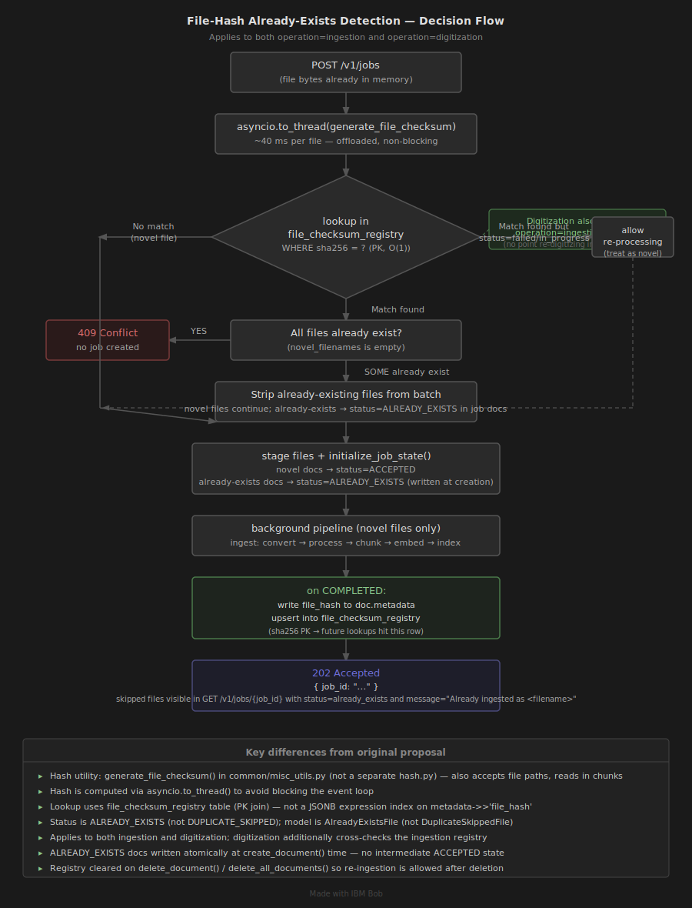
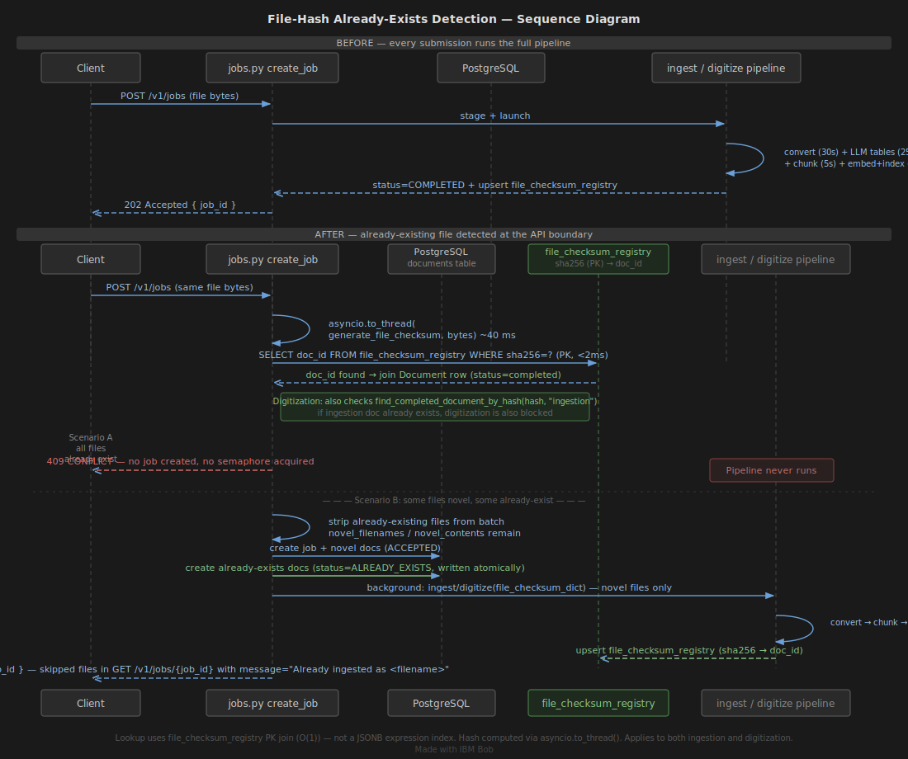

# File-Hash Duplicate Detection — Implementation Specification

**Branch:** `dupIndex`
**Scope:** Both `operation=ingestion` and `operation=digitization`.
**Strategy:** Option B — lenient batch dedup. Strip already-existing files from a
multi-file submission, process only novel files, and record skipped files directly in
the job's document list with status `already_exists`.

### Diagrams

| Flowchart | Sequence |
|---|---|
|  |  |

---

## Table of Contents

1. [Overview](#1-overview)
2. [New `ALREADY_EXISTS` Document Status](#2-new-already_exists-document-status)
3. [New `JobCreatedResponse` Shape](#3-new-jobcreatedresponse-shape)
4. [Touch-point 1 — Hash utility (`services/common/misc_utils.py`)](#4-touch-point-1--hash-utility)
5. [Touch-point 2 — DB schema: `file_checksum_registry` table](#5-touch-point-2--db-schema-file_checksum_registry-table)
6. [Touch-point 3 — `DatabaseManager.find_completed_document_by_hash` and `upsert_file_checksum`](#6-touch-point-3--databasemanager-hash-methods)
7. [Touch-point 4 — `create_job` API handler (Option B gate)](#7-touch-point-4--create_job-api-handler-option-b-gate)
8. [Touch-point 5 — `initialize_job_state` (record already-exists docs)](#8-touch-point-5--initialize_job_state-record-already-exists-docs)
9. [Touch-point 6 — `_run_ingest` and `ingest()` (pass checksum dict)](#9-touch-point-6--_run_ingest-and-ingest-pass-checksum-dict)
10. [Touch-point 7 — `_run_digitize` and `digitize()` (pass checksum dict)](#10-touch-point-7--_run_digitize-and-digitize-pass-checksum-dict)
11. [Touch-point 8 — `create_indexing_handler` (persist hash on completion)](#11-touch-point-8--create_indexing_handler-persist-hash-on-completion)
12. [Touch-point 9 — `_categorize_fields` (route `file_hash` to metadata)](#12-touch-point-9--_categorize_fields-route-file_hash-to-metadata)
13. [Touch-point 10 — `_update_document` (register checksum on COMPLETED)](#13-touch-point-10--_update_document-register-checksum-on-completed)
14. [Touch-point 11 — Deletion clears checksum registry](#14-touch-point-11--deletion-clears-checksum-registry)
15. [Touch-point 12 — `get_all_documents` excludes `ALREADY_EXISTS` docs](#15-touch-point-12--get_all_documents-excludes-already_exists-docs)
16. [Data Flow Diagram](#16-data-flow-diagram)
17. [Timing Impact](#17-timing-impact)
18. [Pros and Cons](#18-pros-and-cons)
19. [Edge Cases](#19-edge-cases)

---

## 1. Overview

When a caller submits a batch of files, each file's SHA-256 is computed
**asynchronously (`asyncio.to_thread`) from the already-in-memory bytes** (zero
additional I/O) before any staging or pipeline work begins. The hash is looked up
via the dedicated `file_checksum_registry` table in PostgreSQL (indexed PK read,
~2 ms).

This feature applies to **both** `operation=ingestion` and `operation=digitization`.
A digitization request is additionally blocked if the same file content has already
been successfully ingested — there is no point re-digitizing content that is already
in the vector store.

**Option B behaviour:**

| Scenario | Result |
|---|---|
| All files are new | Normal `202 Accepted` — full pipeline runs |
| Some files already exist | `202 Accepted` — novel files processed, already-existing files recorded as `ALREADY_EXISTS` in the same job (visible via `GET /v1/jobs/{job_id}`) |
| All files already exist | `409 Conflict` — no job created, no pipeline launched |

A file is considered to already exist only if a **previous document** exists with:
- `type = operation` (or `type = 'ingestion'` when the current operation is
  `digitization`)
- `status = 'completed'`
- A matching entry in `file_checksum_registry`

`failed` and `in_progress` records are **not** treated as already-existing —
re-processing is allowed.

---

## 2. New `ALREADY_EXISTS` Document Status

### 2a. `services/digitize/models.py`

`ALREADY_EXISTS` is added to `DocStatus`:

```python
class DocStatus(str, Enum):
    ACCEPTED = "accepted"
    IN_PROGRESS = "in_progress"
    DIGITIZED = "digitized"
    PROCESSED = "processed"
    CHUNKED = "chunked"
    COMPLETED = "completed"
    FAILED = "failed"
    ALREADY_EXISTS = "already_exists"   # ← NEW
```

### 2b. `services/digitize/db/scripts/init_schema.sql`

The `chk_doc_status` CHECK constraint includes `'already_exists'`:

```sql
CONSTRAINT chk_doc_status CHECK (
    status IN ('accepted', 'in_progress', 'digitized', 'processed',
               'chunked', 'completed', 'failed', 'already_exists')
)
```

⚠️ This is a schema migration. On existing databases drop and re-create the
constraint before deploying:

```sql
ALTER TABLE documents
    DROP CONSTRAINT chk_doc_status,
    ADD CONSTRAINT chk_doc_status CHECK (
        status IN ('accepted', 'in_progress', 'digitized', 'processed',
                   'chunked', 'completed', 'failed', 'already_exists')
    );
```

### 2c. `services/digitize/db/models.py`

The `__table_args__` `CheckConstraint` on `Document` mirrors the SQL:

```python
CheckConstraint(
    "status IN ('accepted', 'in_progress', 'digitized', 'processed',"
    " 'chunked', 'completed', 'failed', 'already_exists')",
    name="chk_doc_status"
),
```

---

## 3. `AlreadyExistsFile` and `JobCreatedResponse` Shape

### 3a. `services/digitize/models.py`

The `DuplicateSkippedFile` model from the original proposal was renamed to
`AlreadyExistsFile`. It carries `existing_doc_name` internally so the
`JobDocumentSummary` can construct a human-readable `message` field —
`"Already ingested as <filename>"` — without an extra API call.

`JobCreatedResponse` contains only `job_id` — the `warnings` field was removed.
Skipped files are recorded directly in the job's document list with
`status = already_exists` and `message = "Already ingested as <name>"`,
visible via `GET /v1/jobs/{job_id}`.

```python
class AlreadyExistsFile(BaseModel):
    """Describes a single file that was skipped because it already exists."""
    filename: str = Field(..., description="Original filename of the skipped file")
    existing_doc_id: str = Field(..., description="doc_id of the already-ingested document")
    existing_doc_name: str = Field(..., description="Name of the already-ingested document")
    file_hash: str = Field(..., description="SHA-256 hash that matched, e.g. 'sha256:e3b0...'")


class JobDocumentSummary(BaseModel):
    """Compact per-document entry for job status responses."""
    id: str
    name: str
    status: str
    message: Optional[str] = Field(
        default=None,
        description="Human-readable message; set when status is 'already_exists', e.g. 'Already ingested as <filename>'",
    )


class JobCreatedResponse(BaseModel):
    """Response model for job creation."""
    job_id: str
```

---

## 4. Touch-point 1 — Hash Utility

**File:** `services/common/misc_utils.py`

Rather than a dedicated `services/digitize/utils/hash.py`, the hash function lives in
the shared utilities module as `generate_file_checksum`. It accepts either raw `bytes`
(hashed in one shot) or a file path (read in 128-block chunks to support large files
without loading them into memory):

```python
def generate_file_checksum(file) -> str:
    """Compute a prefixed SHA-256 hex digest of a file.

    Accepts either a file path (str or Path) or raw bytes.  When passed bytes
    the entire content is hashed in one shot; when passed a path the file is
    read in chunks so arbitrarily large files can be processed without loading
    them entirely into memory.

    The ``sha256:`` prefix makes the algorithm explicit in stored values so
    the hash algorithm can be upgraded in future without ambiguity.

    Returns:
        String in the form ``'sha256:<64-char-hex>'``.
    """
    sha256 = hashlib.sha256()
    if isinstance(file, (bytes, bytearray)):
        sha256.update(file)
    else:
        with open(file, 'rb') as f:
            for chunk in iter(lambda: f.read(128 * sha256.block_size), b''):
                sha256.update(chunk)
    return f"sha256:{sha256.hexdigest()}"
```

**Usage at the API layer** (`services/digitize/api/v1/jobs.py`):

```python
from common.misc_utils import generate_file_checksum
...
file_hash = await asyncio.to_thread(generate_file_checksum, content)
```

Hashing is offloaded to a thread pool via `asyncio.to_thread` to avoid blocking the
async event loop (addressing the Con identified in the earlier proposal).

**Usage in the digitize pipeline** (`services/digitize/pipeline/digitize.py`): when
a pre-computed checksum is not available in `file_checksum_dict`, the function
re-hashes the staged file from disk as a fallback:

```python
file_hash = (
    file_checksum_dict.get(filename)
    if file_checksum_dict
    else generate_file_checksum(file_path.read_bytes())
)
```

> **Note:** The separate `services/digitize/utils/hash.py` described in the earlier
> proposal was not created. The shared utility in `common/misc_utils.py` is used
> everywhere.

---

## 5. Touch-point 2 — DB Schema: `file_checksum_registry` Table

**File:** `services/digitize/db/scripts/init_schema.sql`

Instead of the expression index on `metadata->>'file_hash'` described in the earlier
proposal, the implementation uses a **dedicated lookup table**:

```sql
-- Checksum registry — one row per unique file content, points to the
-- authoritative completed Document for duplicate detection.
-- ON DELETE CASCADE ensures stale registry entries are automatically removed
-- when the referenced document is deleted, preventing orphaned hash entries
-- from blocking future re-ingestion of the same file.
CREATE TABLE IF NOT EXISTS file_checksum_registry (
    sha256        TEXT        PRIMARY KEY,
    doc_id        TEXT        NOT NULL UNIQUE REFERENCES documents(doc_id) ON DELETE CASCADE
);
```

**Why a separate table instead of the JSONB index?**

| Concern | JSONB expression index | `file_checksum_registry` table |
|---|---|---|
| Lookup speed | O(log n) B-tree on expression | O(1) PK lookup |
| Authoritative single source | No — multiple docs could share a hash | Yes — `sha256` is PRIMARY KEY, one row per unique content |
| Cascade on delete | Requires app-level cleanup | `ON DELETE CASCADE` handles it automatically |
| Hash stored in metadata too? | Required for storage | Yes — `file_hash` still stored in `doc.metadata` for visibility in `GET /v1/documents/{id}` responses |

**ORM model** (`services/digitize/db/models.py`):

```python
class FileChecksumRegistry(Base):
    """
    Registry table that maps a SHA-256 digest to the authoritative completed
    Document row for that content.

    The FK to documents(doc_id) ON DELETE CASCADE means registry entries are
    automatically removed when the referenced document is deleted, preventing
    orphaned hashes from blocking future re-ingestion of the same file.
    """
    __tablename__ = "file_checksum_registry"

    sha256: Mapped[str] = mapped_column(Text, primary_key=True)
    doc_id: Mapped[str] = mapped_column(
        Text,
        ForeignKey("documents.doc_id", ondelete="CASCADE"),
        nullable=False,
        unique=True,
    )
```

No additional index is needed — `sha256` is the primary key.

> **Note:** The `idx_documents_file_hash` JSONB expression index described in the
> earlier proposal was not created. The `file_checksum_registry` table supersedes it.

---

## 6. Touch-point 3 — `DatabaseManager` Hash Methods

**File:** `services/digitize/db/manager.py`

Two methods are added to `DatabaseManager`.

### 6a. `find_completed_document_by_hash`

Looks up the registry table rather than querying `metadata->>'file_hash'` directly.
Now accepts an `operation` parameter so the same method handles both ingestion and
digitization dedup checks:

```python
@staticmethod
def find_completed_document_by_hash(
    file_hash: str,
    operation: str = "ingestion",
) -> Optional[Document]:
    """
    Find the completed document of the given operation type with a matching
    file hash, using the file_checksum_registry lookup table.

    Only documents with status='completed' and the specified type are considered.
    Failed and in-progress documents are deliberately excluded so that a previous
    failed attempt does not prevent re-processing of the same file.

    Args:
        file_hash: Prefixed SHA-256 digest, e.g. 'sha256:e3b0c44...'
        operation: Document type to match — 'ingestion' or 'digitization'.

    Returns:
        The matching Document ORM object (attributes eagerly loaded and
        expunged from session), or None if no completed duplicate exists.
    """
    try:
        with get_db_session() as session:
            stmt = (
                select(Document)
                .join(
                    FileChecksumRegistry,
                    FileChecksumRegistry.doc_id == Document.doc_id,
                )
                .where(
                    FileChecksumRegistry.sha256 == file_hash,
                    Document.type == operation,
                    Document.status == DocStatus.COMPLETED.value,
                )
                .limit(1)
            )
            doc = session.scalar(stmt)
            if doc:
                # Eagerly load all attributes before session closes to prevent
                # DetachedInstanceError in the caller.
                _ = (
                    doc.doc_id, doc.job_id, doc.name, doc.type,
                    doc.status, doc.output_format, doc.submitted_at,
                    doc.completed_at, doc.error, doc.doc_metadata,
                )
                session.expunge(doc)
                logger.debug(
                    f"Duplicate detected: file_hash={file_hash[:20]}... "
                    f"matches doc_id={doc.doc_id}"
                )
            return doc
    except SQLAlchemyError as e:
        logger.error(f"DB error in hash lookup for {file_hash[:20]}...: {e}", exc_info=True)
        # Do NOT raise — a lookup failure must not block processing.
        # If the DB is unavailable the caller treats the file as novel.
        return None
```

> **Key difference from earlier proposal:** The query joins `file_checksum_registry`
> instead of filtering on `func.jsonb_extract_path_text(Document.doc_metadata,
> "file_hash")`. This is faster and simpler, and the `operation` parameter supports
> both ingestion and digitization dedup in a single method.

### 6b. `upsert_file_checksum`

Registers a completed document in the registry. Called from `_update_document` in
`utils/db.py` whenever a document transitions to `COMPLETED` status and has a
`file_hash` in its metadata update:

```python
@staticmethod
def upsert_file_checksum(sha256: str, doc_id: str) -> None:
    """
    Insert or update a (sha256, doc_id) pair in file_checksum_registry.

    Called once a document reaches COMPLETED status so that subsequent
    uploads of the same content are caught via find_completed_document_by_hash.

    Args:
        sha256: Prefixed SHA-256 digest, e.g. 'sha256:e3b0c44...'
        doc_id: The completed document's primary key.
    """
    try:
        with get_db_session() as session:
            stmt = (
                insert(FileChecksumRegistry)
                .values(sha256=sha256, doc_id=doc_id)
                .on_conflict_do_update(
                    index_elements=["sha256"],
                    set_={"doc_id": doc_id},
                )
            )
            session.execute(stmt)
            logger.debug(f"Upserted checksum registry: sha256={sha256[:20]}... doc_id={doc_id}")
    except SQLAlchemyError as e:
        logger.error(f"DB error upserting checksum for {sha256[:20]}...: {e}", exc_info=True)
```

---

## 7. Touch-point 4 — `create_job` API Handler (Option B Gate)

**File:** `services/digitize/api/v1/jobs.py`

### 7a. Imports

```python
from common.misc_utils import get_logger, validate_document_file, cleanup_staging_directory, generate_file_checksum
from digitize.db.manager import db_manager
```

No separate `digitize.utils.hash` import — `generate_file_checksum` comes from
`common.misc_utils`.

### 7b. Dedup check (step 5b) — key differences from earlier proposal

The live implementation differs from the earlier proposal in the following ways:

1. **Applies to both operations**, not ingestion-only.
2. **Digitization cross-checks ingestion**: if the file is already indexed (ingestion
   completed), a digitization request is also blocked — no point re-digitizing content
   already in the vector store.
3. **Hash is offloaded**: `await asyncio.to_thread(generate_file_checksum, content)`
   prevents blocking the event loop.
4. **`file_checksum_dict` is built in the same loop** (novel files only), eliminating
   the separate post-loop construction step described in the earlier proposal.
5. **Model names**: `AlreadyExistsFile` (not `DuplicateSkippedFile`);
   `already_exists_files` (not `skipped_files`).

```python
        # 5b. File-hash already-exists detection.
        #
        # Each file is hashed and checked against completed documents of the same
        # operation type. Files that already exist are removed from the batch; novel
        # files continue. If ALL files already exist, return 409 immediately (no job
        # created). If SOME files already exist, only novel files are processed;
        # skipped files are recorded in the job's document list with status
        # `already_exists` (visible via GET /v1/jobs/{job_id}).
        #
        # A file already exists only if a document with:
        #   - type   = operation ('ingestion' or 'digitization')
        #   - status = 'completed'
        #   - sha256 in file_checksum_registry
        # is found. Failed / in-progress records are NOT considered to already exist.
        #
        # For digitization, an ingestion-completed document also counts — no point
        # re-digitizing content that is already indexed.

        already_exists_files: list[models.AlreadyExistsFile] = []
        file_checksum_dict: dict[str, str] = {}  # filename -> "sha256:..." (novel files only)

        novel_filenames: list[str] = []
        novel_contents:  list[bytes] = []

        for filename, content in zip(filenames, file_contents):
            file_hash = await asyncio.to_thread(generate_file_checksum, content)
            existing = db_manager.find_completed_document_by_hash(file_hash, operation.value)

            # A digitization request is also blocked by a completed ingestion of the
            # same file — no point re-digitizing content that is already indexed.
            if not existing and operation == models.OperationType.DIGITIZATION:
                existing = db_manager.find_completed_document_by_hash(
                    file_hash, models.OperationType.INGESTION.value
                )

            if existing:
                logger.info(
                    f"File '{filename}' already exists — matches completed "
                    f"doc_id={existing.doc_id} (hash={file_hash[:20]}...)"
                )
                already_exists_files.append(
                    models.AlreadyExistsFile(
                        filename=filename,
                        existing_doc_id=existing.doc_id,
                        existing_doc_name=existing.name,
                        file_hash=file_hash,
                    )
                )
            else:
                novel_filenames.append(filename)
                novel_contents.append(content)
                file_checksum_dict[filename] = file_hash  # built here, not in a separate step

        # All files already exist → 409 Conflict, no job created.
        if not novel_filenames:
            skipped_summary = ", ".join(
                f"'{s.filename}' (existing doc: {s.existing_doc_id})"
                for s in already_exists_files
            )
            logger.warning(
                f"All {len(already_exists_files)} submitted file(s) already exist. "
                f"No job created. Files: {skipped_summary}"
            )
            APIError.raise_error(
                ErrorCode.RESOURCE_LOCKED,
                f"All submitted files have already been processed: {skipped_summary}. "
                f"Delete the existing documents first if you want to re-process.",
            )

        # Replace filenames/file_contents with the novel subset only.
        filenames     = novel_filenames
        file_contents = novel_contents

        # 6. Acquire semaphore slot.
        await concurrency_manager.acquire(op_key)

        # 7. Stage files and schedule background task.
        try:
            await dg_util.stage_upload_files(
                job_id,
                filenames,
                str(settings.digitize.staging_dir / job_id),
                file_contents,
            )
            doc_id_dict = dg_util.initialize_job_state(
                job_id, operation, output_format, filenames, job_name,
                already_exists_files=already_exists_files,
            )
            if operation == models.OperationType.INGESTION:
                background_tasks.add_task(
                    _run_ingest, job_id, filenames, doc_id_dict, file_checksum_dict
                )
            else:
                background_tasks.add_task(
                    _run_digitize, job_id, doc_id_dict, output_format, file_checksum_dict
                )
        except Exception as exc:
            concurrency_manager.release(op_key)
            logger.error(
                f"Failed to schedule background task for job {job_id}, "
                f"semaphore released: {exc}"
            )
            APIError.raise_error("INTERNAL_SERVER_ERROR", str(exc))

        return {"job_id": job_id}
```

---

## 8. Touch-point 5 — `initialize_job_state` (record already-exists docs)

**File:** `services/digitize/utils/jobs.py`

### 8a. Signature

```python
def initialize_job_state(
    job_id: str,
    operation: str,
    output_format: OutputFormat,
    documents_info: list[str],
    job_name: Optional[str] = None,
    already_exists_files: Optional[list] = None,   # list[AlreadyExistsFile]
) -> dict[str, str]:
```

### 8b. Job creation: `total_documents` covers both novel and already-exists files

```python
all_filenames = list(documents_info) + (
    [f.filename for f in already_exists_files] if already_exists_files else []
)
create_job(
    job_id=job_id,
    operation=operation,
    submitted_at=submitted_at,
    documents_info=all_filenames,
    job_name=job_name
)
```

### 8c. `ALREADY_EXISTS` docs are written in a single `create_document` call

Unlike the earlier proposal (which called `create_document` at `ACCEPTED` then
`update_doc_metadata` to set `ALREADY_EXISTS`), the live implementation passes
`initial_status` and `extra_metadata` directly to `create_document`. There is no
intermediate accepted state and no follow-up metadata update call:

```python
if already_exists_files:
    from digitize.utils.db import get_status_manager
    from digitize.models import JobStatus as _JobStatus
    status_mgr = get_status_manager(job_id)
    for skipped in already_exists_files:
        skipped_doc_id = generate_uuid()
        doc_id_dict[skipped.filename] = skipped_doc_id
        logger.debug(
            f"Recording already_exists doc {skipped_doc_id} "
            f"for file '{skipped.filename}'"
        )
        create_document(
            doc_name=skipped.filename,
            doc_id=skipped_doc_id,
            job_id=job_id,
            output_format=output_format,
            operation=operation,
            submitted_at=submitted_at,
            initial_status=DocStatus.ALREADY_EXISTS,   # written directly at creation
            completed_at=submitted_at,                 # immediately terminal
            extra_metadata={
                "existing_doc_id": skipped.existing_doc_id,
                "existing_doc_name": skipped.existing_doc_name,
                "file_hash": skipped.file_hash,
            },
        )
        # Update job progress stats — doc_id is empty string because the doc
        # status was set at creation; only the job-level stats need refreshing.
        status_mgr.update_job_progress(
            "",
            DocStatus.ALREADY_EXISTS,
            _JobStatus.IN_PROGRESS,
        )
```

> **Key difference from earlier proposal:**
> - Parameter name is `already_exists_files`, not `skipped_files`.
> - `create_document` accepts `initial_status`, `completed_at`, and `extra_metadata`
>   parameters added as part of this feature.
> - `update_job_progress` is called with an empty `doc_id` (job-level stats refresh
>   only), not with the skipped doc's id.
> - No `update_doc_metadata` call needed — the terminal state is written atomically.

### 8d. `_update_job` stats recalculation

`DatabaseStatusManager._update_job` (in `utils/db.py`) does **not** use incremental
counters. Instead, it re-fetches all documents for the job and recomputes stats from
scratch. `ALREADY_EXISTS` counts toward `completed`:

```python
stats = {
    "total_documents": len(documents),
    "completed": sum(
        1 for d in documents
        if d.status in (DocStatus.COMPLETED.value, DocStatus.ALREADY_EXISTS.value)
    ),
    "failed": sum(1 for d in documents if d.status == DocStatus.FAILED.value),
    "in_progress": sum(
        1 for d in documents if d.status in [
            DocStatus.ACCEPTED.value,
            DocStatus.IN_PROGRESS.value,
            DocStatus.DIGITIZED.value,
            DocStatus.PROCESSED.value,
            DocStatus.CHUNKED.value
        ]
    )
}
```

> **Difference from earlier proposal:** The proposal added a branch
> `elif doc_status in (DocStatus.COMPLETED, DocStatus.DUPLICATE_SKIPPED)` to an
> incremental counter. The live code recalculates from DB state on every update,
> which is simpler and self-healing.

---

## 9. Touch-point 6 — `_run_ingest` and `ingest()` (pass checksum dict)

### 9a. `services/digitize/api/v1/jobs.py` — `_run_ingest` signature

```python
async def _run_ingest(
    job_id: str,
    filenames: List[str],
    doc_id_dict: dict,
    file_checksum_dict: Optional[dict] = None,  # filename -> "sha256:..."
) -> None:
```

Passes `file_checksum_dict` through to `ingest()`:

```python
await asyncio.to_thread(ingest, job_staging_path, job_id, doc_id_dict, file_checksum_dict)
```

> **Naming:** The parameter is `file_checksum_dict` throughout (not `file_hash_dict`
> as named in the earlier proposal).

### 9b. `services/digitize/pipeline/ingest.py` — `ingest()` signature

```python
def ingest(
    directory_path: Path,
    job_id: Optional[str] = None,
    doc_id_dict: Optional[dict] = None,
    file_checksum_dict: Optional[dict] = None,  # filename -> "sha256:..."
):
```

Passed to `create_indexing_handler`:

```python
indexing_handler = create_indexing_handler(
    emb_model_dict, status_mgr, doc_id_dict, file_checksum_dict
)
```

---

## 10. Touch-point 7 — `_run_digitize` and `digitize()` (pass checksum dict)

This touch-point was not in the original proposal. The digitization pipeline also
persists the file hash on completion.

### 10a. `services/digitize/api/v1/jobs.py` — `_run_digitize` signature

```python
async def _run_digitize(
    job_id: str,
    doc_id_dict: dict,
    output_format: models.OutputFormat,
    file_checksum_dict: Optional[dict] = None,  # filename -> "sha256:..."
) -> None:
```

Passed through to `digitize()`:

```python
await asyncio.to_thread(digitize, job_staging_path, job_id, doc_id_dict, output_format, file_checksum_dict)
```

### 10b. `services/digitize/pipeline/digitize.py` — `digitize()` signature

```python
def digitize(
    directory_path: Path,
    job_id: str,
    doc_id_dict: dict,
    output_format: OutputFormat,
    file_checksum_dict: dict | None = None,  # filename -> "sha256:..." pre-computed at upload
):
```

On `COMPLETED`, stores the hash (using the pre-computed value from
`file_checksum_dict` if available, otherwise re-hashes from disk):

```python
file_hash = (
    file_checksum_dict.get(filename)
    if file_checksum_dict
    else generate_file_checksum(file_path.read_bytes())
)
status_mgr.update_doc_metadata(doc_id, {
    "status": DocStatus.COMPLETED,
    "pages": page_count,
    "completed_at": get_utc_timestamp(),
    "timing_in_secs": {"digitizing": round(conversion_time, 2)},
    "file_hash": file_hash,
})
```

The disk-based fallback ensures that documents digitized without a pre-computed
checksum (e.g. from a recovery path) still get their hash registered.

---

## 11. Touch-point 8 — `create_indexing_handler` (persist hash on completion)

**File:** `services/digitize/pipeline/ingest.py`

### 11a. Updated signature

```python
def create_indexing_handler(
    emb_model_dict: dict,
    status_mgr: Optional[DatabaseStatusManager],
    doc_id_dict: Optional[dict],
    file_checksum_dict: Optional[dict] = None,  # filename -> "sha256:..."
):
```

### 11b. Inside `index_document_chunks`, success branch

```python
file_hash = (
    file_checksum_dict.get(Path(path).name)
    if file_checksum_dict else None
)
metadata_update = {
    "status": DocStatus.COMPLETED,
    "completed_at": get_utc_timestamp(),
    "timing_in_secs": {"indexing": round(indexing_time, 2)},
}
if file_hash:
    metadata_update["file_hash"] = file_hash

status_mgr.update_doc_metadata(doc_id, metadata_update)
```

`Path` is already imported at the top of `ingest.py`.

---

## 12. Touch-point 9 — `_categorize_fields` (route `file_hash` to metadata)

**File:** `services/digitize/utils/db.py`

`METADATA_KEYS` includes both `file_hash` and `existing_doc_id` so neither key falls
through to `top_level_fields` (which would result in silent data loss):

```python
METADATA_KEYS = {"pages", "tables", "chunks", "timing_in_secs", "file_hash", "existing_doc_id"}
```

---

## 13. Touch-point 10 — `_update_document` (register checksum on COMPLETED)

**File:** `services/digitize/utils/db.py` — `DatabaseStatusManager._update_document`

After a successful `update_document` call, if the status just became `COMPLETED`
**and** a `file_hash` was present in `metadata_fields`, the checksum is registered
in `file_checksum_registry` via `upsert_file_checksum`:

```python
if (
    update_params.get("status") == DocStatus.COMPLETED
    and "file_hash" in metadata_fields
):
    db_manager.upsert_file_checksum(metadata_fields["file_hash"], doc_id)
```

This is the bridge between the pipeline's `update_doc_metadata(…, {"file_hash": …})`
call and the `file_checksum_registry` table. It ensures the registry is populated
atomically with (or just after) the document reaching `COMPLETED` status.

---

## 14. Touch-point 11 — Deletion clears checksum registry

**File:** `services/digitize/db/manager.py`

### 14a. `delete_document`

Explicitly removes the registry row before deleting the document (though
`ON DELETE CASCADE` would also handle it automatically, the explicit delete is a
belt-and-suspenders guard):

```python
session.execute(
    delete(FileChecksumRegistry).where(FileChecksumRegistry.doc_id == doc_id)
)
stmt = delete(Document).where(Document.doc_id == doc_id)
```

### 14b. `delete_all_documents`

Wipes the entire checksum registry before deleting all documents, so a full reset
does not leave orphaned hash entries that would block future re-ingestion:

```python
session.execute(delete(FileChecksumRegistry))
stmt = delete(Document)
```

---

## 15. Touch-point 12 — `get_all_documents` excludes `ALREADY_EXISTS` docs

**File:** `services/digitize/db/manager.py` — `DatabaseManager.get_all_documents`

`ALREADY_EXISTS` documents are job-scoped audit records, not real standalone
documents. They are excluded from the global `GET /v1/documents` listing:

```python
# Exclude already_exists docs from the global listing — they are
# job-scoped audit records, not real ingested documents.
filters.append(Document.status != DocStatus.ALREADY_EXISTS.value)
```

They remain visible when fetching a specific job via `GET /v1/jobs/{job_id}`, where
the full document list (including `ALREADY_EXISTS` entries) is returned.

Similarly, `get_job_document_stats` in `utils/jobs.py` counts `ALREADY_EXISTS`
alongside `COMPLETED` in the `completed_docs` list:

```python
completed_docs = [
    doc for doc in documents
    if doc.get("status") in (DocStatus.COMPLETED.value, DocStatus.ALREADY_EXISTS.value)
]
```

---

## 16. Data Flow Diagram

```
POST /v1/jobs?operation=ingestion|digitization
         │
         ▼
 [1] Block if import/export in progress      ← existing
         │
         ▼
 [2] Guard: empty submission / digitization  ← existing
     multi-file guard
         │
         ▼
 [3] Active-job guard (ingestion only)       ← existing
         │
         ▼
 [4] Semaphore availability pre-check        ← existing
         │
         ▼
 [5] Read & validate files (type, size)      ← existing
         │
         ▼
 [5b] for each file:
       asyncio.to_thread(generate_file_checksum, bytes)  ~40ms  ← NEW
       db_manager.find_completed_document_by_hash(hash, op)     ← NEW
       if digitization: also check ingestion hash               ← NEW
         │
    ┌────┴──────────────────────┐
    │ all novel                 │ some / all already exist
    ▼                           ▼
[6] acquire               split batch:
    semaphore                novel → continue
                             already-exists → AlreadyExistsFile list
                               │
                          ┌────┴─────────────────┐
                          │ novel files remain   │ no novel files remain
                          ▼                      ▼
                     stage + initialize     APIError 409 CONFLICT
                     job (ALREADY_EXISTS    (no job created,
                     docs written at        no semaphore acquired)
                     creation with
                     initial_status)
                          │
                          ▼
        background: ingest(file_checksum_dict) / digitize(file_checksum_dict)
                          │
             ┌────────────┼──────────────────┐
             ▼            ▼                  ▼
          convert     process(LLM)        chunk
             │                              │
             └──────────────────────────► ──▼
                                      embed + bulk-insert
                                      on COMPLETED:
                                        write file_hash to doc metadata
                                        → upsert_file_checksum into
                                          file_checksum_registry          ← NEW
```

---

## 17. Timing Impact

| Phase | First (new) processing | Already-exists |
|---|---|---|
| SHA-256 hash (async, in-process) | +40 ms | +40 ms |
| PostgreSQL registry PK lookup | +1 ms | +1 ms |
| File staging | unchanged | **0 ms** (skipped) |
| Docling conversion | unchanged | **0 ms** (skipped) |
| Text processing | unchanged | **0 ms** (skipped) |
| LLM table summarisation | unchanged | **0 ms** (skipped) |
| Chunking | unchanged | **0 ms** (skipped) |
| Embedding | unchanged | **0 ms** (skipped) |
| OpenSearch bulk insert | unchanged | **0 ms** (skipped) |
| **Total** | ~64 s + 41 ms overhead | **~41 ms** (99.9% reduction) |

The PK lookup on `file_checksum_registry.sha256` is faster than the JSONB expression
index proposed earlier because it hits a dedicated B-tree index on a plain text
column (not a function index on a JSONB blob).

---

## 18. Pros and Cons

### Pros

| # | Benefit |
|---|---|
| 1 | **Earliest possible short-circuit** — dedup fires before staging, semaphore acquisition, DB job creation, and all pipeline work. |
| 2 | **Content-addressed, not name-addressed** — same bytes under a different filename are still caught; different bytes under the same filename are still accepted. |
| 3 | **No pipeline changes for new files** — the full pipeline is completely unmodified for novel content. |
| 4 | **Lenient batch handling** — partial batches are processed; a large upload is not entirely rejected because one file was re-submitted. |
| 5 | **Transparent to caller** — skipped files appear in the job's document list with `status = already_exists` and `message = "Already ingested as <filename>"`, so the caller can inspect the result via `GET /v1/jobs/{job_id}` without an extra documents lookup. |
| 6 | **Failed processing is re-triable** — only `status=completed` records trigger dedup. A previously failed file can be re-submitted freely. |
| 7 | **No embedding server cost on already-existing files** — the embedding model is never called. |
| 8 | **O(1) PK lookup** — `file_checksum_registry.sha256` is a primary key; lookup cost is constant regardless of total document count. |
| 9 | **Cascade delete safety** — `ON DELETE CASCADE` on `file_checksum_registry` ensures registry entries are cleaned up automatically when a document is deleted. |
| 10 | **Covers both operations** — digitization is also guarded; a file already indexed via ingestion is not re-digitized. |
| 11 | **Event-loop safety** — hashing is offloaded via `asyncio.to_thread`, so a large file does not block the server. |

### Cons

| # | Concern | Mitigation |
|---|---|---|
| 1 | **Schema migration required** — `chk_doc_status` must be updated and `file_checksum_registry` table must be created on existing databases before deploying. | Include migration SQL in release notes (see Touch-points 2 and 5). `CREATE TABLE IF NOT EXISTS` is idempotent for new deployments. |
| 2 | **Hash not stored for documents processed before this change** — existing completed documents have no entry in `file_checksum_registry`, so they will not be caught as duplicates until re-processed once. | Acceptable for initial rollout; a one-time backfill script could populate the registry from the existing `metadata->>'file_hash'` values. |
| 3 | **Lenient mode creates partial jobs** — a job that contains both novel and already-existing docs is slightly harder to reason about in status checks. | The `ALREADY_EXISTS` status makes the distinction explicit and inspectable. `ALREADY_EXISTS` docs are excluded from the global documents listing but visible per-job via `GET /v1/jobs/{job_id}`. |
| 4 | **SHA-256 collision is theoretically possible** | Astronomically unlikely (2^256 search space). Non-issue in practice. |
| 5 | **`existing_doc_id` in metadata is not a foreign-key-enforced reference** | The referenced `doc_id` should be validated to exist before writing. Add a `db_manager.get_document_by_id(existing.doc_id)` check if strict integrity is required. |
| 6 | **`file_checksum_registry` adds an extra write on every COMPLETED transition** | The `upsert_file_checksum` call is a single-row INSERT ON CONFLICT DO UPDATE — negligible overhead. |

---

## 19. Edge Cases

### E1 — Concurrent duplicate submission (race condition)

**Scenario:** Two identical files are submitted in parallel before either has completed
processing, so neither has a `file_checksum_registry` entry when both do the hash
lookup.

**Result:** Both pass the dedup gate. Both run the full pipeline. Both end up indexed.
This is the same situation that existed before this feature. It is acceptable because:
- `ingestion_concurrency_limit = 1` (see `settings.py`) means only one ingestion job
  runs at a time. A second identical submission while the first is `in_progress` will
  receive a "An ingestion job is already running" `429` from the existing active-job
  guard in `create_job` step 3 — **before** reaching the dedup check.

**Conclusion:** No additional handling needed given the existing concurrency model.

---

### E2 — Caller deletes a document and re-submits the same file

**Scenario:** File `A.pdf` is ingested, marked `completed`, then deleted via
`DELETE /v1/documents/{doc_id}`. The same bytes are submitted again.

**Result:** `delete_document` removes the `file_checksum_registry` row (via the
explicit `DELETE` plus `ON DELETE CASCADE`). `find_completed_document_by_hash`
returns `None`. The file is treated as novel and re-ingested. ✅

---

### E3 — Same file submitted in a multi-file batch alongside new files

**Scenario:** `[new_file.pdf, existing_file.pdf]` submitted in one request.

**Result (Option B):** `existing_file.pdf` is stripped. Job is created for
`new_file.pdf` only. Response:
```json
{
  "job_id": "abc-123"
}
```
`existing_file.pdf` appears in `GET /v1/jobs/abc-123` with
`"status": "already_exists"` and `"message": "Already ingested as <name of existing doc>"`.

---

### E4 — All files in a batch already exist

**Scenario:** `[dup1.pdf, dup2.pdf]` — both already indexed.

**Result:** `409 Conflict`. Error message lists both filenames and their existing
`doc_id`s. No job created. No semaphore acquired. ✅

---

### E5 — Previous processing of same file failed

**Scenario:** `A.pdf` was ingested, Docling conversion crashed, doc status = `failed`.
Same bytes submitted again.

**Result:** `find_completed_document_by_hash` returns `None` (the registry only
contains rows for `COMPLETED` documents; a failed document is never registered).
File is treated as novel. Full pipeline re-runs. ✅

---

### E6 — File modified between submissions (different content, same name)

**Scenario:** `report.pdf` v1 ingested, then caller modifies the file and re-submits
`report.pdf` v2 (different bytes, same filename).

**Result:** SHA-256 of v2 ≠ SHA-256 of v1. No registry entry exists for v2's hash.
`find_completed_document_by_hash` returns `None`. v2 is treated as novel and
processed independently, resulting in two separate documents both named `report.pdf`
in the DB. ✅ (This is intentional — dedup is content-addressed, not name-addressed.)

---

### E7 — Hash lookup DB failure (transient error)

**Scenario:** PostgreSQL is briefly unavailable during the hash lookup.

**Result:** `find_completed_document_by_hash` catches the `SQLAlchemyError`,
logs it, and returns `None`. The file is treated as novel. Processing proceeds.
A potential duplicate may be processed twice, but the service remains available. ✅

**Trade-off:** Availability is prioritised over strict dedup. If strict dedup is
required even under DB failure, change the `except` block to re-raise, which will
propagate as a `500` to the caller.

---

### E8 — `ALREADY_EXISTS` doc appearing in job stats `completed` count

**Scenario:** Caller checks `GET /v1/jobs/{job_id}` after a partial batch.

**Result:** `ALREADY_EXISTS` documents count toward `stats.completed` (see
Touch-point 5d). The `documents` list shows each file's status explicitly, so the
caller can distinguish real completions from already-existing ones. The job reaches
`JobStatus.COMPLETED` normally once all novel files finish. ✅

---

### E9 — `file_hash` not in `METADATA_KEYS` (silent data loss)

**Scenario:** Developer adds `file_hash` to a metadata update but `METADATA_KEYS` is
not updated.

**Result:** `_categorize_fields` routes `file_hash` to `top_level_fields`.
`update_document` receives `file_hash=...` as a kwarg but the SQLAlchemy `update()`
call only knows about actual column names — the kwarg is silently ignored. The hash
is never persisted. `upsert_file_checksum` is never called. Future dedup checks
return `None`. Dedup silently stops working.

**Mitigation:** `file_hash` is in `METADATA_KEYS` (Touch-point 9). Also add a unit
test that verifies `file_hash` survives a round-trip through `update_doc_metadata`.

---

### E10 — Digitization of a file that is already ingested

**Scenario:** `document.pdf` was previously ingested (type=`ingestion`,
status=`completed`). The same file is submitted with `operation=digitization`.

**Result:** `find_completed_document_by_hash(hash, "digitization")` returns `None`
(no digitization-type completed document). The cross-check
`find_completed_document_by_hash(hash, "ingestion")` returns the ingestion document.
The file is treated as already-existing, and the digitization request returns `409`
(if all files already exist) or records the file as `already_exists` in the job's
document list (if part of a mixed batch). ✅ This prevents redundant digitization
of content already in the vector store.

---

*Made with IBM Bob*
